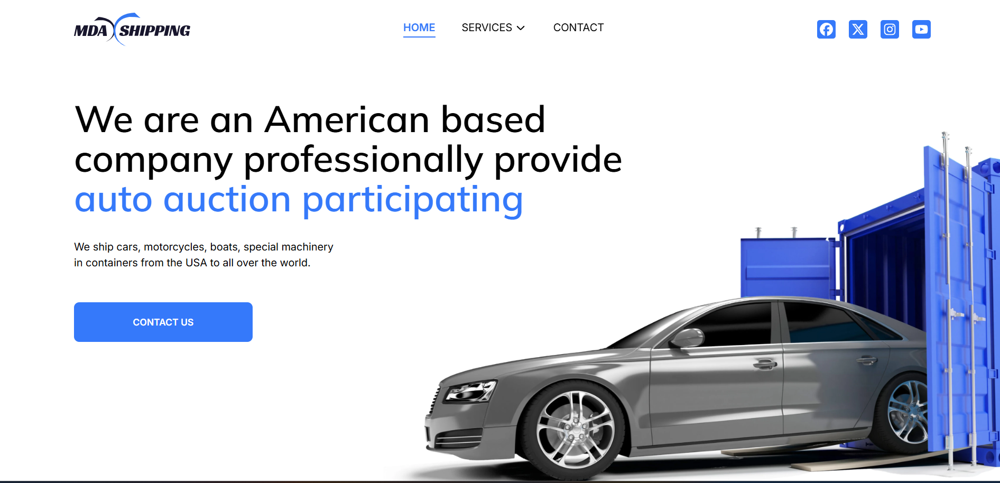
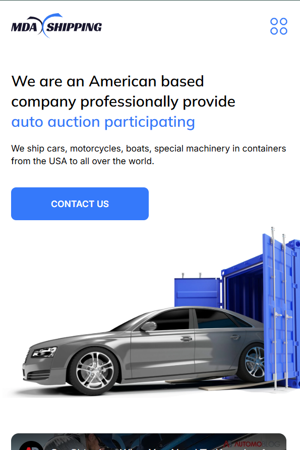

# FullStack website

- Car Shipping MERN Stack Website showing the companys method of operations in their field of shipping cars. It is a user friendly website. 

## Table of contents

- [Screenshot](#screenshot)
- [Links](#links)
- [Built with](#built-with)

## Screenshot

                This is a desktop View.
                 

              This is a mobile view.
                 
  

   
  

  
### Links

[Demo](https://mda-shipping-tau.vercel.app/)

### Built with

- NodeJS/ExpressJS - Backend proxy for creating Backend API
- [MongoDB](https://www.mongodb.com/) - Database 
- [Tailwind CSS](https://tailwindcss.com) - CSS Framework
- Framer Motion -  React Animation Library
- [React](https://reactjs.org/) - JS Frontend Framework
- Vite - Frontend buildups
